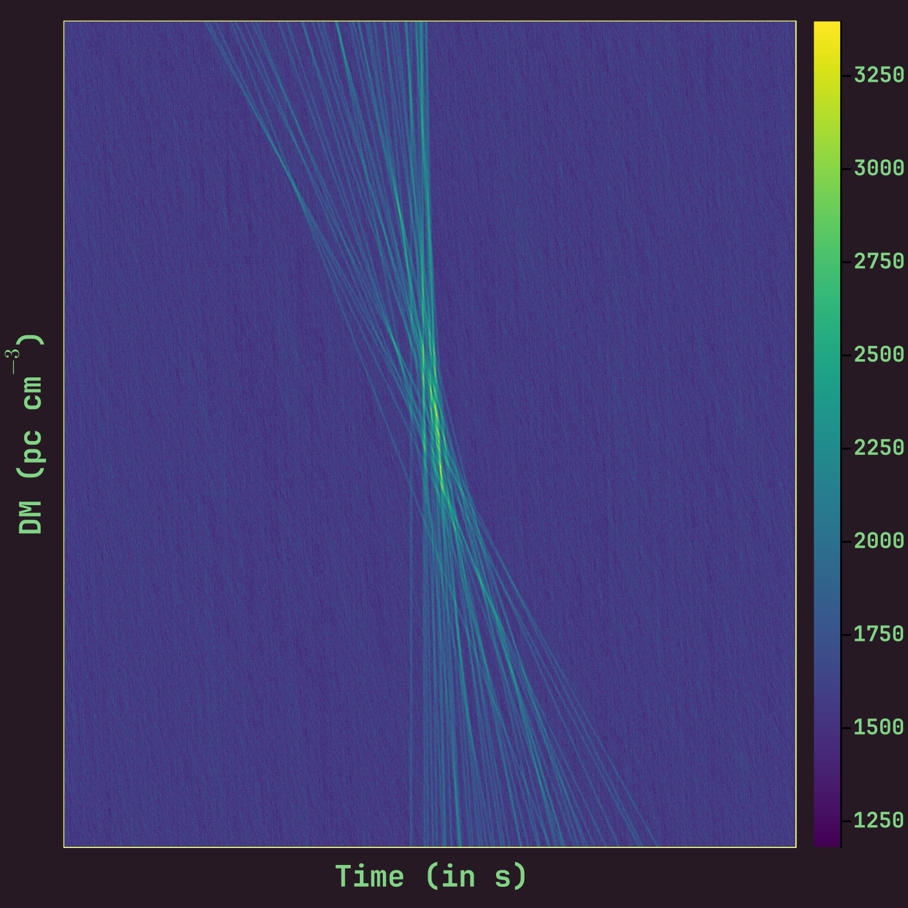

<div align="center">
<h1><code>FastDedispersion.jl</code></h1>
<h4><i>The fast DM transform, in Julia.</i></h4>
<br/>

![License][license]
![GitHub Stars][stars]
[![Gitmoji Badge][gitmoji_badge]][gitmoji]

<br/>
</div>

<div align="justify">

Install it by typing and running:

```bash
] add FastDedispersion
```

in the Julia REPL.


Here is an example of the DM transform, obtained via `FastDedispersion.jl`, from 30 seconds of simulated FRB data. The FRB has a DM of 1000 pc cm$^{-3}$, and an arrival time of 5 seconds, and was dedispersed from 900 to 1100 pc cm$^{-3}$. Note that the plot is zoomed-in, so that we may easily see the expected bow-tie pattern:

<br/>



The simulation was carried out using the [**`simulateSearch`**](https://bitbucket.csiro.au/projects/PSRSOFT/repos/simulatesearch/browse) library. The corresponding data file, in the SIGPROC filterbank format, is included in this package as a part of its testing suite [**here**](./test/data/frb.fil)[^1].

[^1]: The file can be read in Julia using the [**`SIGPROCFiles.jl`**][SF] package.

</div>

[gitmoji]: https://gitmoji.dev
[presto]: https://github.com/scottransom/presto
[SF]: https://github.com/astrogewgaw/SIGPROCFiles.jl
[gitmoji_badge]: https://img.shields.io/badge/gitmoji-%20😜%20😍-FFDD67.svg?style=for-the-badge
[stars]: https://img.shields.io/github/stars/astrogewgaw/FastDedispersion.jl?style=for-the-badge
[license]: https://img.shields.io/github/license/astrogewgaw/FastDedispersion.jl?style=for-the-badge
